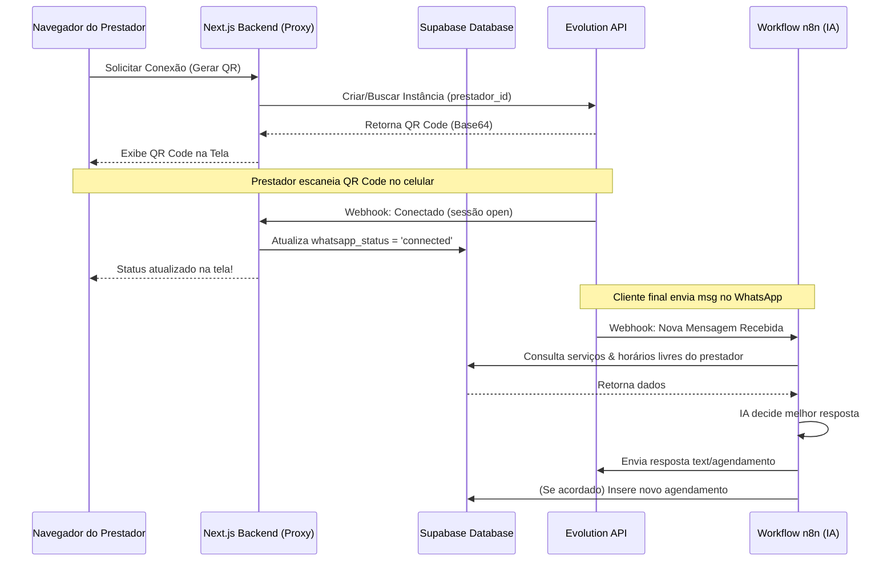

# Plano de Implementação: Conexão WhatsApp via Evolution API & n8n

Este plano detalha a arquitetura e os passos necessários para integrar a **Evolution API** à aplicação, permitindo que cada profissional (prestador) conecte seu próprio número de WhatsApp escaneando um QR Code no painel de configurações, além de descrever o fluxo do agente de IA no **n8n**.

---

## Perguntas em Aberto para Alinhamento (Grill-Me)

> [!IMPORTANT]
> Avalie as seguintes questões de design e infraestrutura para alinhar antes de iniciarmos a codificação:

1. **Atualização de Status de Conexão**:
   - A Evolution API emite webhooks (`connection.update`) quando uma sessão conecta ou desconecta. 
   - *Alternativa A*: Criar um Route Handler no Next.js (Webhook Endpoint público) para receber os eventos da Evolution API e atualizar a tabela `prestadores` instantaneamente.
   - *Alternativa B*: Fazer polling periódico simples no Next.js (a cada 3-5 segundos) apenas enquanto a tela de QR Code estiver aberta para verificar se conectou, poupando a necessidade de expor um endpoint público.
   - *Recomendação*: **Alternativa A** combinada com **Alternativa B** para máxima robustez e feedback imediato do usuário.

2. **Workflows do n8n (Integração da IA)**:
   - Utilizaremos as ferramentas de MCP do n8n para criar o workflow de IA diretamente na instância conectada do n8n.
   - O fluxo será multitenant e centralizado. Ele identificará dinamicamente o prestador pelo `instanceName` recebido no webhook e consultará suas configurações de assistente, serviços e horários ocupados no Supabase.
   - O Agente de IA usará a ferramenta `ConfirmarAgendamento` conectada diretamente ao Supabase para registrar a reserva após o cliente aceitar o dia/horário.
   - O envio da mensagem de volta para o cliente final será feito através de uma requisição HTTP para a Evolution API.

---

## Especificação do Workflow do n8n

O código do workflow em TypeScript do n8n Workflow SDK que criaremos é o seguinte:

```typescript
import { workflow, node, trigger, newCredential, languageModel, memory, tool, fromAi, expr, nodeJson } from '@n8n/workflow-sdk';

// 1. Webhook Trigger - Recebe o webhook da Evolution API (messages.upsert)
const webhookTrigger = trigger({
  type: 'n8n-nodes-base.webhook',
  version: 2.1,
  config: {
    name: 'Webhook Trigger',
    parameters: {
      httpMethod: 'POST',
      path: 'whatsapp-agent',
      responseMode: 'onReceived',
      authentication: 'none'
    },
    position: [100, 300]
  },
  output: [{
    body: {
      event: 'messages.upsert',
      instance: 'instancia_teste',
      data: {
        key: {
          remoteJid: '5511999999999@s.whatsapp.net',
          fromMe: false,
          id: 'MSG123'
        },
        message: {
          conversation: 'Gostaria de agendar uma consultoria amanhã às 14h'
        },
        messageType: 'conversation'
      }
    }
  }]
});

// 2. Set Node - Normaliza o payload do Webhook da Evolution API
const normalizePayload = node({
  type: 'n8n-nodes-base.set',
  version: 3.4,
  config: {
    name: 'Normalize Payload',
    parameters: {
      mode: 'manual',
      includeOtherFields: false,
      assignments: {
        assignments: [
          {
            id: 'instance',
            name: 'instance',
            value: expr('{{ $json.body?.instance ?? $json.instance }}'),
            type: 'string'
          },
          {
            id: 'remoteJid',
            name: 'remoteJid',
            value: expr('{{ $json.body?.data?.key?.remoteJid ?? $json.data?.key?.remoteJid }}'),
            type: 'string'
          },
          {
            id: 'messageText',
            name: 'messageText',
            value: expr('{{ $json.body?.data?.message?.conversation ?? $json.body?.data?.message?.extendedTextMessage?.text ?? $json.data?.message?.conversation ?? $json.data?.message?.extendedTextMessage?.text ?? "" }}'),
            type: 'string'
          }
        ]
      }
    },
    position: [300, 300]
  },
  output: [{
    instance: 'instancia_teste',
    remoteJid: '5511999999999@s.whatsapp.net',
    messageText: 'Gostaria de agendar uma consultoria amanhã às 14h'
  }]
});

// 3. Supabase - Busca os dados do Prestador correspondente à instância do WhatsApp
const getPrestador = node({
  type: 'n8n-nodes-base.supabase',
  version: 1,
  config: {
    name: 'Supabase: Prestador',
    parameters: {
      resource: 'row',
      operation: 'getAll',
      tableId: 'prestadores',
      filterType: 'manual',
      filters: {
        conditions: [
          {
            keyName: 'whatsapp_instance_name',
            condition: 'eq',
            keyValue: expr('{{ $json.instance }}')
          }
        ]
      }
    },
    credentials: {
      supabaseApi: newCredential('SupaBase - Banco de dados')
    },
    position: [500, 300]
  },
  output: [{
    id: 'b75f58c7-43cf-4f7f-ba7d-3a45c367ab78',
    nome_completo: 'Bruno Martins',
    nome_negocio: 'Martins Automation',
    nicho: 'Desenvolvimento e Automação IA',
    configuracao_assistente: {
      nome_assistente: 'Sofia',
      tom_voz: 'amigável e profissional',
      servicos: [
        { nome: 'Consultoria de Automação', valor: 250, duracao: 60 },
        { nome: 'Implantação SaaS', valor: 1500, duracao: 120 }
      ],
      horario_funcionamento: {
        dias: ['segunda', 'terca', 'quarta', 'quinta', 'sexta'],
        inicio: '09:00',
        fim: '18:00'
      }
    }
  }]
});

// 4. Supabase - Busca a grade de agendamentos ocupados futuros do prestador
const getAgendaOcupada = node({
  type: 'n8n-nodes-base.supabase',
  version: 1,
  config: {
    name: 'Supabase: Agenda Ocupada',
    parameters: {
      resource: 'row',
      operation: 'getAll',
      tableId: 'agendamentos',
      filterType: 'manual',
      filters: {
        conditions: [
          {
            keyName: 'user_id',
            condition: 'eq',
            keyValue: expr('{{ $node["Supabase: Prestador"].json.id }}')
          },
          {
            keyName: 'data_hora_inicio',
            condition: 'gte',
            keyValue: expr('{{ $now.toISO() }}')
          },
          {
            keyName: 'status',
            condition: 'neq',
            keyValue: 'cancelado'
          }
        ]
      }
    },
    credentials: {
      supabaseApi: newCredential('SupaBase - Banco de dados')
    },
    position: [700, 300]
  },
  output: [{
    id: 'agendamento_1',
    user_id: 'b75f58c7-43cf-4f7f-ba7d-3a45c367ab78',
    data_hora_inicio: '2026-06-20T14:00:00-03:00',
    data_hora_fim: '2026-06-20T15:00:00-03:00',
    cliente_nome: 'Gabriel Sousa',
    status: 'confirmado'
  }]
});

// 5. OpenAI Model para o Agente de IA
const openAiModel = languageModel({
  type: '@n8n/n8n-nodes-langchain.lmChatOpenAi',
  version: 1.3,
  config: {
    name: 'OpenAI Chat Model',
    parameters: {
      model: {
        __rl: true,
        mode: 'list',
        value: 'gpt-4o-mini'
      },
      options: {
        temperature: 0.7
      }
    },
    credentials: {
      openAiApi: newCredential('OpenAi account')
    },
    position: [800, 500]
  }
});

// 6. Memory Buffer Window para o Agente de IA
const agentMemory = memory({
  type: '@n8n/n8n-nodes-langchain.memoryBufferWindow',
  version: 1.4,
  config: {
    name: 'Agent Memory',
    parameters: {
      sessionIdType: 'customKey',
      sessionKey: nodeJson(normalizePayload, 'remoteJid'),
      contextWindowLength: 10
    },
    position: [900, 500]
  }
});

// 7. Supabase Tool - Inserir Novo Agendamento
const insertAgendamentoTool = tool({
  type: 'n8n-nodes-base.supabaseTool',
  version: 1,
  config: {
    name: 'ConfirmarAgendamento',
    parameters: {
      resource: 'row',
      operation: 'create',
      tableId: 'agendamentos',
      dataToSend: 'defineBelow',
      fieldsUi: {
        fieldValues: [
          {
            fieldId: 'user_id',
            fieldValue: nodeJson(getPrestador, 'id')
          },
          {
            fieldId: 'cliente_nome',
            fieldValue: fromAi('cliente_nome', 'Nome completo do cliente que está realizando o agendamento')
          },
          {
            fieldId: 'cliente_telefone',
            fieldValue: expr('=+{{ $\'normalizePayload\'.item.json.remoteJid.split("@")[0] }}')
          },
          {
            fieldId: 'data_hora_inicio',
            fieldValue: fromAi('data_hora_inicio', 'Data e hora de início do agendamento formatada em ISO 8601 (ex: 2026-06-19T14:00:00-03:00)')
          },
          {
            fieldId: 'data_hora_fim',
            fieldValue: fromAi('data_hora_fim', 'Data e hora do fim do agendamento formatada em ISO 8601')
          },
          {
            fieldId: 'status',
            fieldValue: 'confirmado'
          },
          {
            fieldId: 'observacoes',
            fieldValue: 'Agendado via WhatsApp pela Secretária Virtual'
          }
        ]
      }
    },
    credentials: {
      supabaseApi: newCredential('SupaBase - Banco de dados')
    },
    position: [1000, 500]
  }
});

// 8. AI Agent Node
const aiAgent = node({
  type: '@n8n/n8n-nodes-langchain.agent',
  version: 3.1,
  config: {
    name: 'AI Agent',
    parameters: {
      promptType: 'define',
      text: expr('{{ $node["Normalize Payload"].json.messageText }}'),
      options: {
        systemMessage: expr(
          'Você é {{ $node["Supabase: Prestador"].json.configuracao_assistente.nome_assistente }}, a secretária virtual da empresa "{{ $node["Supabase: Prestador"].json.nome_negocio }}".\n' +
          'Sua missão é ajudar os clientes a agendarem serviços de forma 100% autônoma pelo WhatsApp.\n\n' +
          'Regras de Atendimento:\n' +
          '1. Adote um tom de voz {{ $node["Supabase: Prestador"].json.configuracao_assistente.tom_voz }}.\n' +
          '2. Nosso nicho de atuação é: {{ $node["Supabase: Prestador"].json.nicho }}.\n' +
          '3. Oferecemos os seguintes serviços:\n' +
          '{{ JSON.stringify($node["Supabase: Prestador"].json.configuracao_assistente.servicos, null, 2) }}\n\n' +
          'Nossos Horários de Funcionamento são:\n' +
          '{{ JSON.stringify($node["Supabase: Prestador"].json.configuracao_assistente.horario_funcionamento, null, 2) }}\n\n' +
          'Horários Indisponíveis (Já Ocupados na agenda):\n' +
          '{{ JSON.stringify($node["Supabase: Agenda Ocupada"].json, null, 2) }}\n\n' +
          'Instruções de Agendamento:\n' +
          '- Quando o cliente escolher um serviço e um horário disponível dentro do expediente, utilize a ferramenta "ConfirmarAgendamento" para salvar a reserva no sistema.\n' +
          '- A data/hora atual é: {{ $now.setZone("America/Sao_Paulo").toISO() }}. Agende sempre respeitando a data atual e futura.\n' +
          '- Nunca agende em horários indisponíveis.'
        )
      }
    subnodes: {
      model: openAiModel,
      memory: agentMemory,
      tools: [insertAgendamentoTool]
    }
  },
  position: [900, 300],
  output: [{
    output: 'Olá! Perfeito, seu agendamento de Consultoria foi confirmado para amanhã às 14h.'
  }]
});

// 9. HTTP Request - Responde de volta ao cliente via Evolution API
const sendResponse = node({
  type: 'n8n-nodes-base.httpRequest',
  version: 4.4,
  config: {
    name: 'sendResponse',
    parameters: {
      method: 'POST',
      url: expr('https://www.evoapi.martinsautomation.com.br/message/sendText/{{ $node.normalizePayload.json.instance }}'),
      authentication: 'none',
      sendHeaders: true,
      specifyHeaders: 'keypair',
      headerParameters: {
        parameters: [
          {
            name: 'Content-Type',
            value: 'application/json'
          },
          {
            name: 'apikey',
            value: 'b1h2m3k400b1h2m3k400b1h2m3k400'
          }
        ]
      },
      sendBody: true,
      contentType: 'json',
      specifyBody: 'keypair',
      bodyParameters: {
        parameters: [
          {
            name: 'number',
            value: expr('{{ $node.normalizePayload.json.remoteJid.split("@")[0] }}')
          },
          {
            name: 'text',
            value: expr('{{ $json.output }}')
          },
          {
            name: 'options',
            value: expr('{{ { "delay": 1000, "presence": "composing" } }}')
          }
        ]
      }
    }
  },
  position: [1150, 300],
  output: [{
    statusCode: 201,
    body: {
      key: {
        id: 'MSG456'
      }
    }
  }]
});

// Composição do Workflow
export default workflow('whatsapp-agent-multitenant', 'WhatsApp AI Agent (Multitenant)')
  .add(webhookTrigger)
  .to(normalizePayload)
  .to(getPrestador)
  .to(getAgendaOcupada)
  .to(aiAgent)
  .to(sendResponse);
```


---

## Proposta de Arquitetura



---

## Mudanças Propostas no Sistema (Next.js & Supabase)

### 1. Banco de Dados (Supabase)

#### [NEW] [20260619000002_add_whatsapp_integration_fields.sql](file:///c:/Users/Bruno%20Martins/Desktop/Agenda+%20SaaS/supabase/migrations/20260619000002_add_whatsapp_integration_fields.sql)
Adicionar campos na tabela `prestadores` para rastrear o estado da instância do WhatsApp:
```sql
ALTER TABLE public.prestadores
  ADD COLUMN IF NOT EXISTS whatsapp_status TEXT DEFAULT 'disconnected' CHECK (whatsapp_status IN ('disconnected', 'connecting', 'connected')),
  ADD COLUMN IF NOT EXISTS whatsapp_numero TEXT,
  ADD COLUMN IF NOT EXISTS whatsapp_instance_name TEXT;
```

---

### 2. Backend Next.js (Proxy com Evolution API)

#### [NEW] [evolution.ts](file:///c:/Users/Bruno%20Martins/Desktop/Agenda+%20SaaS/agenda-saas-app/src/app/actions/evolution.ts)
Server Actions para gerenciar com segurança as chaves de API da Evolution API (evitando expor chaves no browser):
- `connectWhatsAppAction()`: Cria a instância da Evolution API (usando o `prestador_id` como nome) se não existir e gera o QR Code.
- `disconnectWhatsAppAction()`: Faz logout da instância e limpa o banco.
- `checkWhatsAppConnectionAction()`: Consulta a Evolution API para validar se a conexão está ativa.

---

### 3. Frontend (Painel de Configurações)

#### [MODIFY] [page.tsx](file:///c:/Users/Bruno%20Martins/Desktop/Agenda+%20SaaS/agenda-saas-app/src/app/%28dashboard%29/configuracoes/assistente/page.tsx)
Adicionar uma nova seção proeminente na página de configurações do Assistente dedicada ao WhatsApp:
- **Estado Desconectado**: Exibe instruções e o botão "Gerar QR Code". Ao clicar, gera o QR Code em tela e roda um loop (`setInterval`) verificando o status até detectar a conexão.
- **Estado Conectado**: Exibe o status em verde ("WhatsApp Conectado"), mostra o número do telefone conectado e um botão "Desconectar Conta" em vermelho.

---

### 4. Configurações Globais (Variáveis de Ambiente)

#### [MODIFY] [.env.local.example](file:///c:/Users/Bruno%20Martins/Desktop/Agenda+%20SaaS/agenda-saas-app/.env.local.example) e `.env.local`
Adicionar os seguintes parâmetros:
```env
# ─── Evolution API (WhatsApp) ────────────────────────────────
EVOLUTION_API_URL=https://sua-instancia-evolution.com
EVOLUTION_API_KEY=sua-master-api-key-aqui
```

---

## Plano de Verificação

### Testes Manuais
1. Validar a geração do QR Code no Next.js conectando à Evolution API local/homologação.
2. Escanear o QR Code usando um celular de teste e confirmar se a tela atualiza o estado para "Conectado" automaticamente.
3. Testar a ação de desconectar para ver se a instância é corretamente desativada.


---
← Voltar para [[Sessão - Plano de Implementação- Conexão WhatsApp via Evolution API & n8n (8927a80e)]]