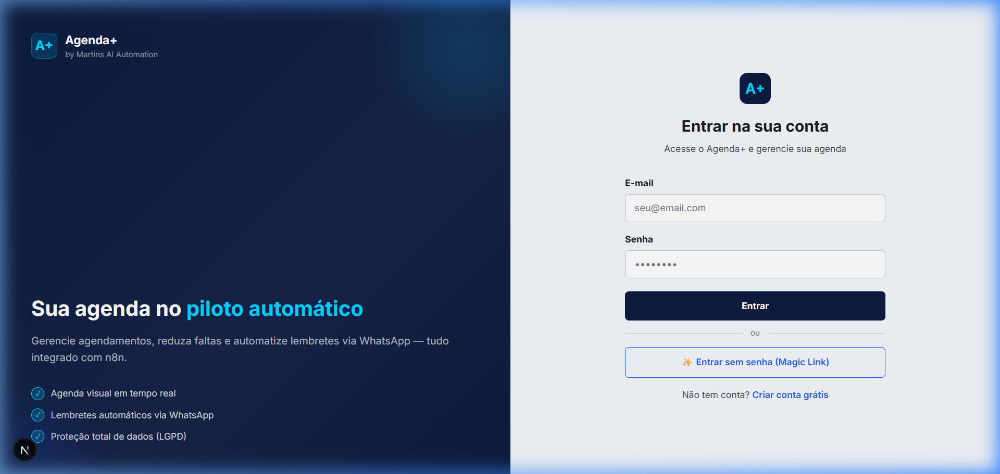
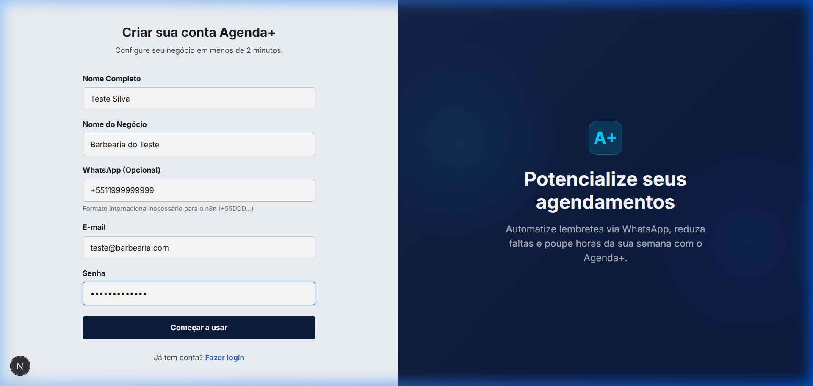
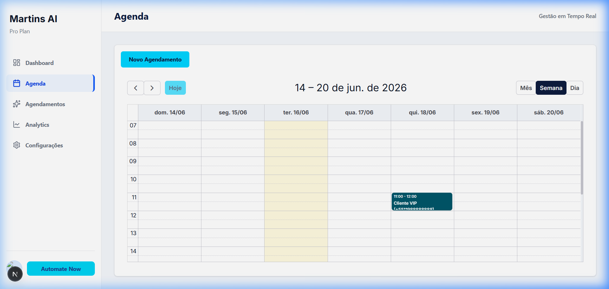
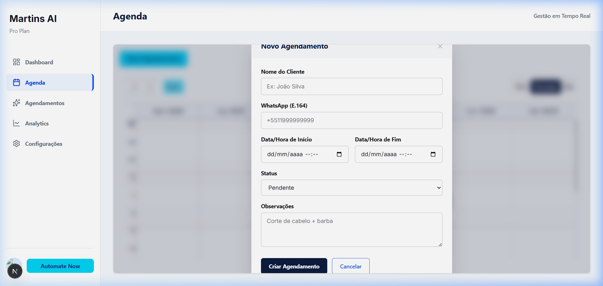
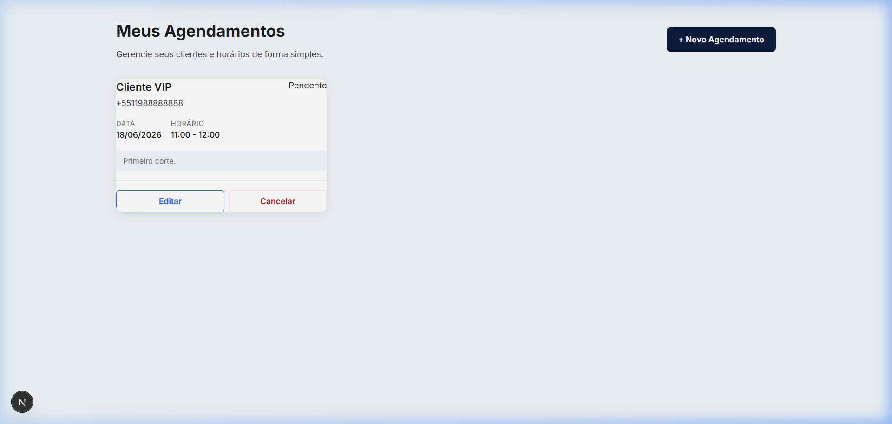

# Agenda+ SaaS (Sistema de Agendamentos Inteligente)

Sistema de gestão de agendamentos baseado em IA, projetado para automatizar e otimizar o agendamento de serviços. O sistema permite que prestadores de serviços configurem seus horários, nichos e assistentes de IA, enquanto clientes podem agendar serviços de forma rápida e intuitiva via WhatsApp.

## 📋 Índice
- [Tecnologias Utilizadas](#-tecnologias-utilizadas)
- [Estrutura do Projeto](#-estrutura-do-projeto)
- [Instalação](#-instalação)
- [Configuração](#-configuração)
- [Funcionalidades](#-funcionalidades)
- [Endpoints de API](#-endpoints-de-api)
- [Workflow de Agendamento com IA](#-workflow-de-agendamento-com-ia)

## 🚀 Tecnologias Utilizadas

### Frontend
- **Next.js 14 (App Router)**: Framework React para renderização server-side e geração estática.
- **TypeScript**: Tipagem estática para JavaScript.
- **Tailwind CSS**: Framework CSS utilitário para estilização rápida e responsiva.
- **Shadcn/UI**: Biblioteca de componentes React acessíveis e customizáveis.
- **Lucide React**: Biblioteca de ícones.
- **Radix UI**: Kit de componentes acessíveis.

### Backend & Banco de Dados
- **Supabase**: Plataforma backend como serviço (BaaS) com banco de dados PostgreSQL.
- **PostgreSQL**: Banco de dados relacional.
- **Row Level Security (RLS)**: Políticas de segurança para controle de acesso aos dados.

### Integrações
- **Evolution API**: Plataforma para integração com WhatsApp Business.
- **OpenAI**: Modelo de linguagem para inteligência artificial (assistente).
- **n8n**: Ferramenta de automação para orquestrar integrações (ex: WhatsApp <-> Supabase).

## 📂 Estrutura do Projeto

```
saas_agendaplus/
├── agenda-saas-app/              # Aplicação Next.js
│   ├── src/
│   │   ├── app/                  # Rotas da aplicação
│   │   │   ├── api/              # Endpoints de API
│   │   │   ├── dashboard/        # Páginas da área logada
│   │   │   ├── auth/             # Autenticação
│   │   │   └── [...auth]/       # NextAuth.js configuration
│   │   ├── components/           # Componentes React reutilizáveis
│   │   ├── lib/                  # Funções utilitárias e cliente Supabase
│   │   ├── providers/            # Providers de contexto (auth, theme)
│   │   ├── actions/              # Funções de servidor (Server Actions)
│   │   └── types/                # Definições de tipos TypeScript
│   ├── public/                   # Arquivos estáticos
│   ├── supabase/                 # Configurações do Supabase local (migrations)
│   ├── .env                      # Variáveis de ambiente (não versionar!)
│   └── ...
├── docs/                         # Documentação
│   └── n8n_whatsapp_integration.md # Guia de integração n8n
└── README.md                     # Este arquivo
```

## 🛠️ Instalação

### Pré-requisitos
- **Node.js** 18.x ou superior
- **npm** ou **yarn**
- **PostgreSQL** (local ou remoto)
- **Supabase CLI** (opcional, para desenvolvimento local)

### Passo 1: Clonar o repositório
```bash
git clone https://github.com/brunomartins-dev/saas_agendaplus.git
cd saas_agendaplus
```

### Passo 2: Configurar o Frontend
```bash
cd agenda-saas-app
npm install
```

### Passo 3: Configurar Variáveis de Ambiente
Crie um arquivo `.env` na raiz de `agenda-saas-app/` baseado no `.env.example`:
```bash
# Exemplo de .env
DATABASE_URL="postgresql://postgres:[EMAIL_ADDRESS]:5432/postgres"
NEXT_PUBLIC_SUPABASE_URL="https://your-project.supabase.co"
NEXT_PUBLIC_SUPABASE_ANON_KEY="your-anon-key"
SUPABASE_SERVICE_ROLE_KEY="your-service-role-key"
AUTH_SECRET="your-auth-secret"
OPENAI_API_KEY="your-openai-key"
EVOLUTION_API_URL="https://evolution-api.example.com"
EVOLUTION_INSTANCE_ID="your-instance-id"
```

### Passo 4: Criar as tabelas no Supabase
Se estiver usando o Supabase CLI:
```bash
cd ../supabase
supabase start
```
Ou execute as migrations:
```bash
cd agenda-saas-app
npm run supabase:migrate
```

### Passo 5: Iniciar a Aplicação
```bash
npm run dev
```
A aplicação estará disponível em `http://localhost:3000`.

## 🔄 Workflow de Agendamento com IA

1. **Cliente envia mensagem** via WhatsApp para o número do prestador.
2. **n8n recebe webhook** da Evolution API.
3. **n8n consulta Supabase** para obter dados do prestador e verificar agenda ocupada.
4. **n8n envia contexto ao Agente de IA** (OpenAI GPT-4o).
5. **Agente de IA processa** informações e interage com o cliente.
6. **Cliente confirma detalhes** (data, hora, serviço, nome).
7. **n8n usa Ferramenta (Tool)** para inserir agendamento no Supabase.
8. **n8n envia confirmação** de volta ao cliente via WhatsApp.

## 📄 Documentação

### Funcionalidades Principais

#### 1. Autenticação
- Autenticação via **Magic Link** (e-mail).
- Gerenciamento de sessões seguro.

#### 2. Dashboard do Prestador
- **Visão Geral**: Métricas de agendamentos, clientes e faturamento.
- **Agendamentos**: Visualização de agendamentos confirmados, pendentes e cancelados.
- **Calendário**: Calendário visual de agendamentos.
- **Configurações**:
  - **Perfil**: Informações do prestador.
  - **Negócio**: Nome, nicho, horário de funcionamento.
  - **Assistente AI**: Configuração do assistente de IA.
  - **WhatsApp**: Conexão e status da Evolution API.
  - **Integrações**: Configurações de APIs externas.

#### 3. Sistema de Agendamentos
- **Agendamentos Confirmados**: Visão consolidada de todos os agendamentos.
- **Agendamentos Pendentes**: Agendamentos que requerem confirmação.
- **Agendamentos Cancelados**: Histórico de cancelamentos.

### Endpoints de API

A aplicação expõe endpoints de API para integração com sistemas externos (como o n8n).

#### 🔐 Autenticação
- `POST /api/auth/send-email`: Envia e-mail de login com link mágico.
- `POST /api/auth/callback`: Callback de autenticação.
- `GET /api/auth/me`: Obtém informações do usuário logado.

#### 📅 Agendamentos
- `GET /api/agendamentos`: Lista agendamentos do usuário logado.
- `POST /api/agendamentos`: Cria um novo agendamento.
- `PATCH /api/agendamentos/:id`: Atualiza um agendamento.
- `DELETE /api/agendamentos/:id`: Cancela um agendamento.
- `GET /api/agendamentos/proximos`: Lista agendamentos futuros.
- `GET /api/agendamentos/pendentes`: Lista agendamentos pendentes.
- `GET /api/agendamentos/servicos`: Lista serviços disponíveis.
- `GET /api/agendamentos/servicos/:id`: Detalhes de um serviço.

#### 👥 Clientes
- `GET /api/clientes`: Lista clientes.
- `GET /api/clientes/:id`: Detalhes de um cliente.

#### ⚙️ Configurações
- `GET /api/configuracoes`: Lista configurações do usuário.
- `POST /api/configuracoes/assistente`: Salva configurações do assistente de IA.
- `POST /api/configuracoes/whatsapp`: Salva as configurações de integração e instância do WhatsApp.

---

## 📸 Demonstração Visual (Screenshots)

### 🔐 Autenticação
| Tela de Login | Tela de Cadastro |
|:---:|:---:|
|  |  |

### 📅 Gestão da Agenda
| Visualização em Grid | Modal de Detalhes / Ações |
|:---:|:---:|
|  |  |

### 📋 Lista Geral de Agendamentos

