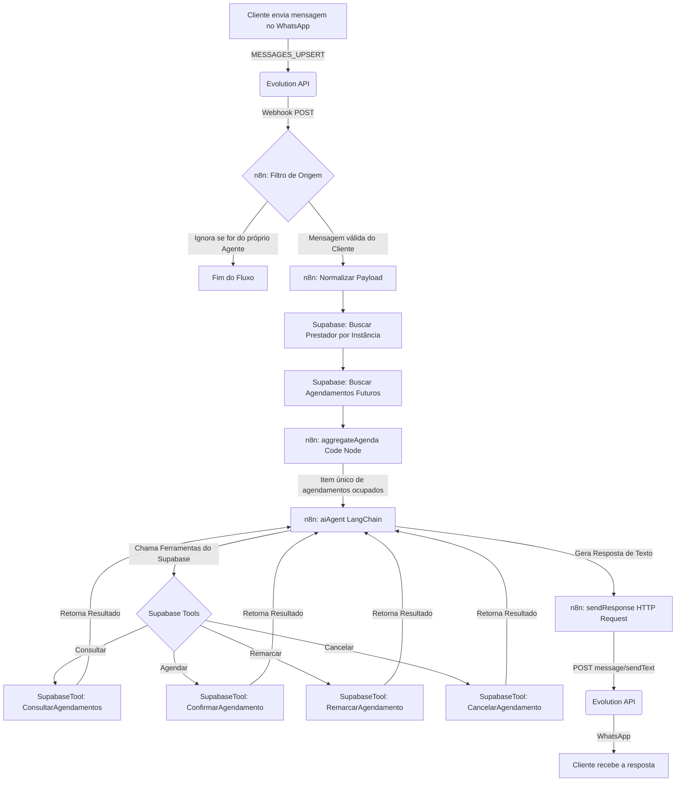

# Agenda+ SaaS (Sistema de Agendamentos Inteligente com IA)

O **Agenda+** é uma plataforma SaaS (Software as a Service) multitenant de gestão de agendamentos e automação visual de alto desempenho. Ela foi projetada especificamente para permitir que prestadores de serviços gerenciem suas agendas de forma moderna, enquanto um Assistente de Inteligência Artificial autônomo realiza o atendimento, negociação de horários, consultas, remarcações e cancelamentos diretamente pelo WhatsApp, 24 horas por dia, 7 dias por semana.

---

## 📋 Índice
- [🚀 Tecnologias Utilizadas](#-tecnologias-utilizadas)
- [📂 Estrutura do Projeto](#-estrutura-do-projeto)
- [⚙️ Funcionalidades Completas do Sistema](#️-funcionalidades-completas-do-sistema)
- [🤖 Arquitetura da IA & Automação (n8n)](#-arquitetura-da-ia--automação-n8n)
- [🛠️ Guia de Instalação e Execução](#️-guia-de-instalação-e-execução)
- [📸 Demonstração Visual (Screenshots)](#-demonstração-visual-screenshots)

---

## 🚀 Tecnologias Utilizadas

### Frontend & Painel Administrativo
- **Next.js 14 (App Router)**: Framework React para renderização híbrida (SSR/ISR) e roteamento avançado.
- **TypeScript**: Tipagem estática rigorosa para garantir a robustez e manutenibilidade do código.
- **Tailwind CSS**: Estilização responsiva e utilitária integrada com design premium e moderno.
- **Shadcn/UI & Radix UI**: Componentes de interface do usuário acessíveis, performáticos e visualmente polidos.
- **Supabase Realtime**: Atualização instantânea da agenda via WebSockets/Subscrições.

### Backend & Segurança
- **Supabase (PostgreSQL)**: Banco de dados relacional de alta confiabilidade.
- **Row Level Security (RLS)**: Políticas de segurança a nível de linha para garantir isolamento absoluto de dados entre prestadores de serviço (Multitenancy).
- **NextAuth.js / Supabase Auth**: Controle de sessões e autenticação segura com suporte a Magic Links.

### Automação & IA (Orquestração)
- **n8n (Self-Hosted)**: Motor de workflow para integrar a Evolution API, o banco de dados Supabase e o provedor de IA.
- **Evolution API (WhatsApp Business)**: API de alto desempenho para envio, leitura e gerenciamento de sessões do WhatsApp.
- **OpenAI GPT / Groq (LangChain)**: Modelos de Inteligência Artificial generativa atuando com agentes orientados a ferramentas (Tools Agent).

---

## 📂 Estrutura do Projeto

```
saas_agendaplus/
├── agenda-saas-app/              # Aplicação Web Next.js (Painel do Prestador)
│   ├── src/
│   │   ├── app/                  # Rotas, API Endpoints e Páginas (App Router)
│   │   │   ├── (auth)/           # Telas de Login e Cadastro
│   │   │   ├── (dashboard)/      # Telas administrativas da área logada
│   │   │   └── api/              # Endpoints e Webhooks (Integrações / Evolution API)
│   │   ├── components/           # Componentes UI reutilizáveis e Agenda Realtime
│   │   ├── lib/                  # Clientes e utilitários de banco (Supabase Server/Client)
│   │   ├── actions/              # Server Actions do Next.js (Integrações Evolution e Configurações)
│   │   └── types/                # Definições de tipos TypeScript do projeto
│   ├── public/                   # Imagens, logotipos e assets estáticos
│   └── tailwind.config.js        # Definições visuais e tokens do Design System
├── docs/                         # Documentação complementar do projeto
│   └── n8n_whatsapp_integration.md # Mapeamento completo do fluxo n8n
└── README.md                     # Documentação principal da plataforma
```

---

## ⚙️ Funcionalidades Completas do Sistema

### 1. Landing Page Corporativa & Apresentação
- **Design de Alto Nível**: Utilização de paleta Navy Dark com elementos em degradê ciano, micro-animações dinâmicas (efeito scan de IA, flutuação e brilho pulsante) e glassmorphism premium.
- **Logomarca Integrada**: Rodapé corporativo unificado integrando o logotipo oficial da empresa em 72px com redirecionamento de link para a home.
- **Painel de Planos**: Exibição das dores operacionais resolvidas (No-Shows, atendimento 24/7) e plano único transparente de R$ 79/mês.

### 2. Autenticação & Cadastro
- **Acesso Descomplicado**: Login por e-mail/senha ou por Magic Link, garantindo agilidade e segurança sem senhas vulneráveis.
- **Cadastro de Prestador**: Fluxo intuitivo com criação automática do perfil do profissional no banco de dados.

### 3. Painel Administrativo do Prestador (Dashboard)
- **Visão Geral e Métricas**: Exibição em tempo real de estatísticas como: agendamentos marcados, estimativa de faturamento, novos clientes cadastrados e taxa de comparecimento.
- **Agenda Visual Interativa (Realtime)**: Grade de calendário baseada no Supabase Realtime. Qualquer agendamento efetuado pela IA no WhatsApp reflete no calendário do painel do prestador em milissegundos, sem necessidade de atualizar a página.
- **Gestão de Agendamentos**: Seções separadas para agendamentos **Confirmados**, **Pendentes** e **Cancelados** com filtros de pesquisa rápidos e opção de cadastrar agendamentos manuais.
- **Gestão de Clientes**: Cadastro centralizado de clientes contendo histórico de agendamentos realizados, telefone de contato e notas de atendimento.

### 4. Configuração do Assistente de IA
- **Identidade do Assistente**: Possibilidade de dar um nome exclusivo para a IA (ex: Clara, Sofia) e escolher o tom de voz do atendimento (Profissional, Amigável, Formal, Descontraído).
- **Regras de Negócio**: Configuração de serviços oferecidos (nome, preço, duração em minutos), além do expediente de funcionamento semanal (horário de início e fim das atividades).

### 5. Configuração & Emparelhamento do WhatsApp (Evolution API)
- **QR Code na Tela**: Geração síncrona do QR Code de conexão diretamente no painel administrativo do prestador.
- **Status da Instância**: Monitoramento em tempo real do status de conexão (`connected`, `connecting`, `disconnected`).
- **Automação de Comportamento**: Configuração dinâmica da instância na Evolution API ao conectar para:
  - Ignorar automaticamente mensagens vindas de grupos (`groupsIgnore: true`).
  - Rejeitar chamadas de voz ou vídeo recebidas no número de WhatsApp (`rejectCall: true`).
  - Marcar conversas como lidas instantaneamente após o recebimento (`readMessages: true`).
  - Configurar e registrar automaticamente o Webhook apontando para o n8n apenas para o evento de mensagens recebidas (`MESSAGES_UPSERT`), desabilitando webhooks por eventos desnecessários (`byEvents: false`).

---

## 🤖 Arquitetura da IA & Automação (n8n)

O coração da automação reside em um fluxo multitenant centralizado no n8n que atende a todos os prestadores e clientes de forma segura e escalável.



### 🛡️ Segurança Multitenant nas Ferramentas (Tools)
As ferramentas expostas à Inteligência Artificial no n8n realizam a validação direta no Supabase, garantindo que o agente de IA nunca acesse ou altere dados de outros prestadores ou clientes (evitando injeção de prompts):
- **Telefone do Cliente Nativo**: O telefone do cliente no WhatsApp (`cliente_telefone`) é capturado de forma silenciosa e injetado diretamente nas condições estáticas das ferramentas do Supabase, com o prefixo internacional `+` formatado dinamicamente (ex: `=+{{ $('normalizePayload').first().json.remoteJid.split('@')[0] }}`). A IA nunca precisa perguntar o número ao cliente.
- **Identificação do Prestador**: As ferramentas filtram os dados usando o `user_id` estático extraído do primeiro item retornado na autenticação do prestador (`{{ $('getPrestador').first().json.id }}`).
- **Prevenção de Erros de Índice**: Todas as expressões internas de referências dinâmicas no fluxo usam a sintaxe `.first().json` (ex: `$('normalizePayload').first().json.messageText`), evitando quebras de iteração do n8n com erros do tipo `pairedItemInvalidIndex`.

---

## 🛠️ Guia de Instalação e Execução

### Pré-requisitos
- **Node.js** 18.x ou superior
- **npm** ou **yarn**
- Banco de dados **PostgreSQL** ou conta ativa no **Supabase**
- Instância ativa da **Evolution API**

### Passo 1: Clonar o Repositório
```bash
git clone https://github.com/brunomartins-dev/saas_agendaplus.git
cd saas_agendaplus
```

### Passo 2: Configurar o Aplicativo Next.js
```bash
cd agenda-saas-app
npm install
```

### Passo 3: Configurar Variáveis de Ambiente
Crie um arquivo `.env.local` na pasta `agenda-saas-app/` com as seguintes credenciais:
```env
# Banco de Dados & Supabase
DATABASE_URL="postgresql://postgres:[PASSWORD]@[HOST]:5432/postgres"
NEXT_PUBLIC_SUPABASE_URL="https://your-project.supabase.co"
NEXT_PUBLIC_SUPABASE_ANON_KEY="your-anon-key"
SUPABASE_SERVICE_ROLE_KEY="your-service-role"

# Autenticação
NEXTAUTH_URL="http://localhost:3000"
NEXTAUTH_SECRET="your-secret-auth-key"

# Integrações Externas
EVOLUTION_API_URL="https://your-evolution-api-domain.com"
EVOLUTION_API_KEY="your-evolution-api-key"
EVOLUTION_WEBHOOK_URL="https://your-n8n-webhook-url.com"
```

### Passo 4: Executar as Migrations do Banco
Crie as tabelas locais ou remotas rodando as migrations:
```bash
npm run supabase:migrate
```

### Passo 5: Iniciar o Servidor de Desenvolvimento
```bash
npm run dev
```
A aplicação estará disponível localmente em `http://localhost:3000`.

---

## 📸 Demonstração Visual (Screenshots)

### 🔐 Autenticação e Entrada
| Tela de Login | Tela de Cadastro |
|:---:|:---:|
|  |  |

### 📅 Gestão da Agenda e Dashboard
| Visualização em Grid (Calendário Realtime) | Detalhes e Ações de Agendamento |
|:---:|:---:|
|  |  |

### 📋 Listagem de Dados
| Histórico Geral de Agendamentos |
|:---:|
|  |